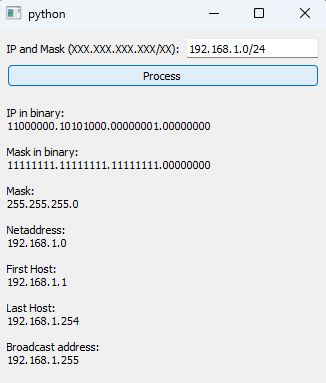

# PyQt5 Subnet Calculator

This project is a simple subnet calculator application built using `PyQt5` 
for the graphical user interface and the `netaddr` library for network 
calculations. It allows users to input an IP address and subnet mask 
(in CIDR notation) and displays key network information.

## Features

*   Calculates and displays the following information:
    *   IP address in binary
    *   Netmask in binary
    *   Netmask (decimal dotted notation)
    *   Network address
    *   First usable host address
    *   Last usable host address
    *   Broadcast address
*   Handles basic input validation and provides error messages.

## Prerequisites

*   Python 3.6 or higher
*   PyQt5 (`pip install PyQt5`)
*   netaddr (`pip install netaddr`)

## How to Run

1.  Clone this repository:

    ```bash
    git clone [invalid URL removed] # Replace with your repo URL
    ```

2.  Navigate to the project directory:

    ```bash
    cd Subnet-Calculator
    ```

3. Run the application:

    ```bash
    python main.py
    ```

## Usage

1.  Enter an IP address and subnet mask in CIDR notation (e.g., 192.168.1.0/24) in the input field.
2.  Click the "Process" button.
3.  The calculated network informations will be displayed in the output area.

## Example

